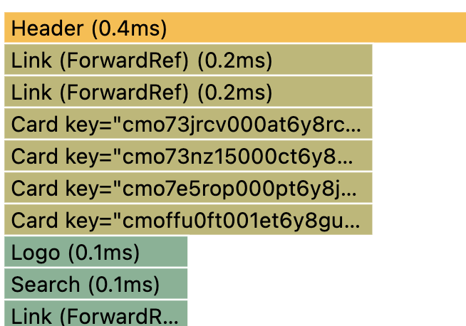
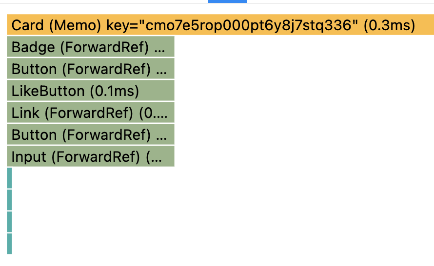
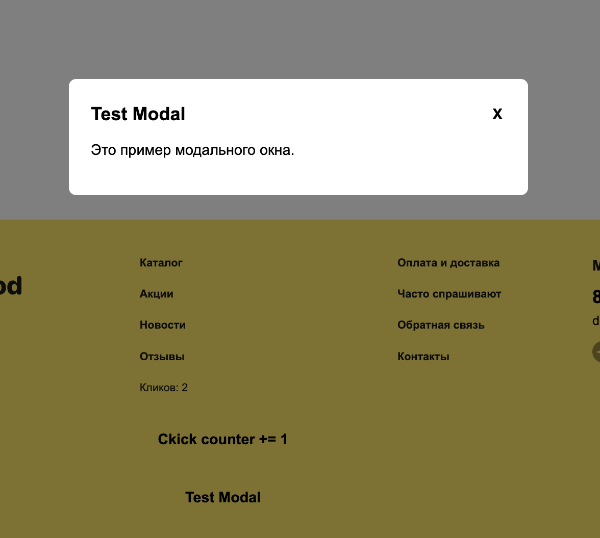

# homework-react-21951242

## Стек технологий

- **Core**: React 19, TypeScript, Redux Toolkit (RTK Query)
- **Styling**: CSS Modules + `classnames`
- **Routing**: React Router DOM v6
- **Build**: Webpack (dev), Vite/ESBuild
- **Architecture**: Feature-Sliced Design (FSD)

## Запуск проекта локально:

- `npm i` - установка зависимостей
- `npm run start` - запуск проекта

## TASK 1

**FSD архитектура**

```
src/
├── app/          # Точка входа, глобальные стили, провайдеры
├── pages/        # Готовые страницы (HomePage, ProductPage, Cart)
├── widgets/      # Крупные блоки страницы (Header, Footer, CardList, формы логина и регистрации)
├── features/     # Функциональные фичи (Auth, Review, Search)
├── entities/     # Бизнес-сущности (Product, Cart, User)
└── shared/       # Переиспользуемые ресурсы (UI, hooks, api, lib)
```

**Новая структура `shared/ui/`**

- ButtonBack/ — кнопки навигации (ButtonBack)
- Button/ — универсальная кнопка
- Badge/ — бейджи (new/sale/discount)
- Counter/ — счётчик +/-
- Input/ — инпуты
- Layout/ — PageLayout (обёртка страницы)
- PageHeader/ — заголовок страницы
- Price/ — цена с/без скидки
- Rating/ — рейтинг (существующий)
- ReviewItem/ — элемент отзыва
- Search/ — поиск
- Spinner/ — спиннер (существующий)
- Textarea/ — текстовое поле

**Рефакторинг**

     - В shared/ui удалены все упомниания стора и селекторов;
     - Большинство частоиспользуемых HTML элементов обёрнуты в компоненты: Button, Input и т.д.;
     - SignIn/SignUp страницы больше не защищены WithProtection, т.к. это страницы входа;
     - Удалены дубликаты HOC (shared/store/HOCs/);
     - Добавлена обработка loading/error состояний в HomePage, FavoritesPage, ProductPage;

**Оптимизация данных**

     - Убран WithQuery HOC — loading/error UI теперь обрабатывается inline через RTK Query хуки
     - Убран useProducts hook — данные теперь берутся напрямую из useGetProductsQuery
     - CartAmount больше не получает products как пропс — использует Redux селектор напрямую
     - Заменены все относительные импорты на алиасы

**Настройки**

     - Настроены Git hooks через husky и lint-staged (lint, format, stylelint)
     - Настроен ESLint resolver для алиасов
     - Добавлены baseUrl и paths в tsconfig.json

## TASK 2

**Card**

До: Каждый Card вызывал useSelector(cartSelectors.getCartProducts). При изменении корзины — все Card ререндерились.

После:

- CardList — подписан на корзину, вычисляет isInCart для каждого продукта;
- Card — не знает о Redux, получает isInCart и onAddToCart как props;
- Стабильный onAddToCart callback — один на все карточки;
- Card и CardList — обернуты в memo.

При нажатии "В корзину" перерендерится только CardList + одна карточка, которая изменила состояние. Остальные Card пропустят рендер благодаря memo.

**Header**

До: рендерится на каждый чих

После:

- React.memo — ререндерится только при изменении user/cart, а не при любом state-чейндже;
- useMemo для likeCount — пересчитывается только при обновлении данных продуктов;
- SVG вынесены в отдельные компоненты — больше не создаются заново при каждом рендере;
- skip: !user?.id — не делаем лишний API-запрос если пользователь не авторизован.

<figure>
  
  <figcaption>До оптимизации</figcaption>
</figure>

<figure>
  
  <figcaption>После оптимизации</figcaption>
</figure>

## TASK 3

- Реализован компонент shared/ui/Modal;
- Использован useRef для фокусировки элементов открытия и закрытия модалки;
- Добавлена кнопка вызова тестовой модалки для демонстрации функционала.

<figure>
  
  <figcaption>Модака</figcaption>
</figure>

## TASK 4

- useRef для фокуса в формах регистрации и авторизации.

## TASK 5

- Добавлены сборщики vite и esbuild;
- Произведено сравнение метрик 3 бандлеров:

### Build Time

| Bundler    | Time  | vs Webpack  |
| ---------- | ----- | ----------- |
| ESBuild    | 2.23с | 89% быстрее |
| Vite + SWC | 5.37с | 74% быстрее |
| Webpack    | 20.6с | baseline    |

### Output Size

| Bundler    | JS Bundle | CSS   | Total    |
| ---------- | --------- | ----- | -------- |
| ESBuild    | 1,126 KB  | 16 KB | 1,142 KB |
| Vite + SWC | 614 KB    | 52 KB | 666 KB   |
| Webpack    | 632 KB    | 62 KB | 694 KB   |

**Вывод:** для дев сборки лучше использовать esbuild, а для prod - старый добрый Webpack. Альтернативный наилучший вариант - использовать Vite для всего;

## TASK 6

- useActionState или useOptimistic для работы с формой отзыва и имитации добавления в список.

<figure>
  
  <figcaption>Оптимистичный UI</figcaption>
</figure>
